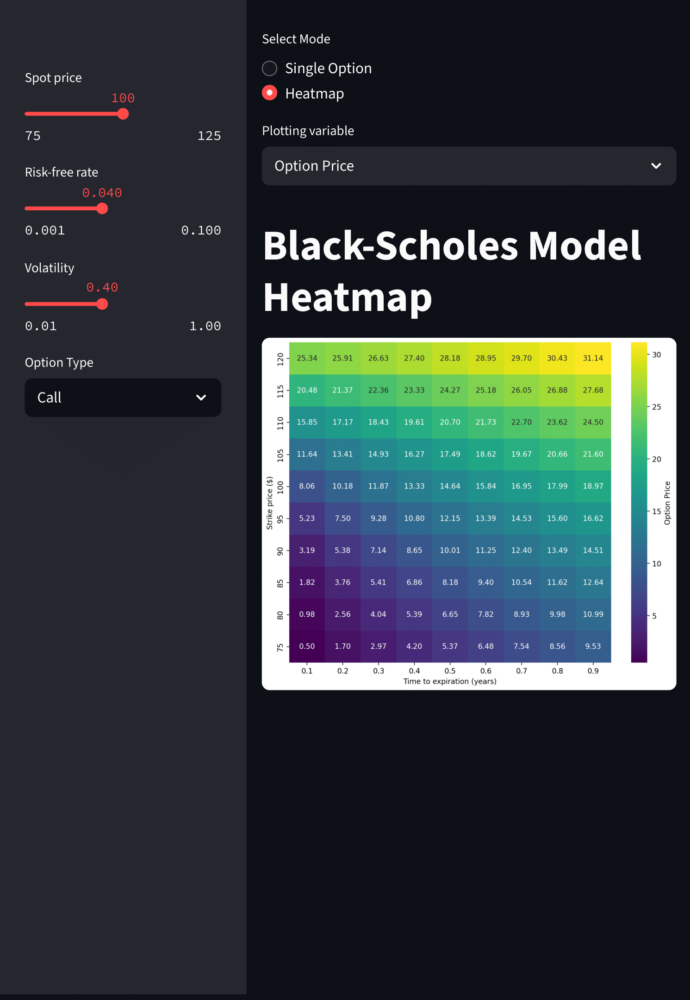

# Option Pricing Python Library

A modular and extensible Python library for pricing vanilla and exotic options using a variety of models including Black-Scholes, binomial trees, and Monte Carlo simulation. It also supports market data retrieval and volatility modeling.

An interactive app is available to demonstrate uses of the package using the `streamlit` library.

Note: If the Streamlit app is asleep when you open it, just click *"Wake up"* and give it a few seconds to load. The app is hosted using the Streamlit Community Cloud so the app may fall asleep if it has been inactive for more than a few hours to save resources.

[](https://cjramsey-option-pricing-python.streamlit.app)

[](https://cjramsey-option-pricing-python.streamlit.app/)

# Getting Started

### 1.  Clone the Repository

```bash
git clone https://github.com/cjramsey/option-pricing-python.git
cd option-pricing-python.git
```

### 2. Install the Package (Editable Mode)

To enable you to freely edit the source code and import modules across folders, install the project in editable mode.

```bash
pip install -e .
```

Make sure you have `pip >= 21.0`, which supports PEP517/518 builds from `pyproject.toml`.

### 3. Install Dependencies

```bash
pip install -r requirements.txt
```
